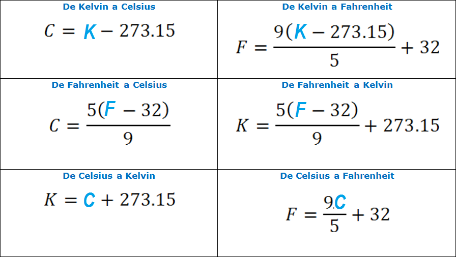

# ¿Qué es una función?

Una función es una forma de organizar y reutilizar código: reúne una secuencia de operaciones bajo un mismo nombre para poder ejecutarlas cada vez que la necesitemos.

Las funciones nos permiten:

-   asignar un **nombre** a un conjunto de instrucciones, para poder reutilizarlo fácilmente
-   evitar tener que recordar y escribir cada paso de manera repetida
-   trabajar con **entradas (inputs)** y obtener **resultados (outputs)** de forma clara
-   estructurar mejor nuestro código y hacerlo más **legible y mantenible**

En la mayoría de los lenguajes de programación, las funciones son un elemento fundamental para construir soluciones más complejas a partir de partes simples.

::: callout-note
Cuando escribes una función, estás creando tu propia herramienta: es uno de los primeros pasos para pensar como programador.
:::

[Source](https://swcarpentry.github.io/r-novice-gapminder-es/10-functions.html)

# Tips para generar una función

](figures/structure_functions.png)

En resumen, la estructura básica de una función en R es la siguiente:

-   **Nombre de la función:** es cómo la identificamos y la llamamos después
-   **Argumentos (inputs):** los valores que recibe la función
-   **Cuerpo de la función:** donde se realizan las operaciones
-   **Valor que devuelve (output):** el resultado que la función devuelve

En conjunto, estos elementos nos permiten construir funciones claras y reutilizables.

**Buenas prácticas al crear funciones**

Al escribir funciones, es recomendable:

-   usar **nombres descriptivos** tanto para la función como para sus argumentos
-   mantener las funciones **simples y enfocadas** (una función = una tarea)
-   incluir explícitamente el `return()` para mayor claridad
-   agregar **validaciones** o **mensajes** cuando sea necesario

::: callout-important
Una buena función no solo funciona, también es fácil de leer, entender y reutilizar.
:::

# Nuestro primer código

> **Problema:** Realizar un algoritmo que solicite al usuario *dos numeros enteros*, realice su suma y la imprima en pantalla.

```{r Primer codigo, eval=FALSE}
# ---Algoritmo(Sumar)---
# 1) Solicitar al usuario los datos de entrada (variable a y b).
# --INICIO--
a <- readline("Digite el primer numero: ")
b <- readline("Digite el segundo numero: ")

# Convertir la entrada en números enteros
a <- as.integer(a)
b <- as.integer(b)

# 2) Realizar la suma de los datos de entrada.
c <- a + b 
 
# 3) Mostrar el resultado.
print(c)
# --FIN_INICIO--
# --- Fin_de_Algoritmo(Sumar) ---
```

**¿Cuál es el problema de este enfoque?**

Este código funciona correctamente, pero tiene una **desventaja** importante:

-   Cada vez que queramos realizar una suma, debemos volver a escribir todo el procedimiento
-   El código puede volverse repetitivo y difícil de mantener
-   No es fácil reutilizarlo en otros programas

💡 **Motivación**

Aquí es donde entran las funciones.

Una función nos permite **encapsular este proceso** en un solo bloque de código que podemos reutilizar tantas veces como queramos.

::: callout-tip
En lugar de repetir el mismo algoritmo, podemos nombrarlo y usarlo cuando lo necesitemos.
:::

# Nuestra primera función

> **Problema:** Crear una función que reciba *dos numeros enteros* y realice su suma.

```{r Funcion - my_sum v1}
my_sum <- function(a, b) {
  c <- a + b
  return(c)
}
```

**Desglose de la función:**

-   `my_sum`: es el **nombre** de la función que creamos.
-   `a,b`: son los **argumentos** de la función.
-   `c <- a + b`: es la **operación** que realiza la función.
-   `return(c)`: devuelve el **resultado** de la función.

:::: callout-important
¿Qué nos falta en la función?

::: {.callout-tip collapse="true" icon="false"}
## Respuesta

No estamos verificando que los valores de entrada sean números enteros.

Actualmente, la función acepta cualquier tipo de dato que pueda sumarse, lo cual puede provocar resultados inesperados.

💡 Una buena práctica es validar los datos de entrada para asegurarnos de que la función se use correctamente.
:::
::::

:::: {.callout-note icon="false"}
## 💻Ejercicio: Nuestra segunda función

Define una función que:

-   reciba dos números enteros como argumentos
-   calcule su suma
-   devuelva el resultado

Asegúrate de que la función funcione correctamente para distintos valores de entrada.

::: {.callout-tip collapse="true" icon="false"}
## Solución

```{r Funcion - my_sum v2}
my_sum <- function(a, b) {
  
  # Convertir la entrada en números enteros
  a <- as.integer(a)
  b <- as.integer(b)
  
  # Realizar la suma
  c <- a + b

  # Devolver el resultado
  return(c)
}
```

En esta versión estamos forzando que los datos sean enteros usando `as.integer()`.

💡 Esto [NO]{style="color: red;"} valida los datos, solo los convierte. Por ejemplo, `3` se convierte correctamente, pero `hola` se convierte en `NA`.

Una mejora adicional sería validar los datos de entrada antes de realizar la operación. Esto lo veremos más adelante.
:::
::::

## Verificación / Realizar pruebas

Una vez definida la función, es importante probarla para asegurarnos de que funciona como esperamos.

Antes de ejecutarla, reflexiona:

> **¿Qué resultado esperas obtener al evaluar `my_sum(3, 4)`?**

```{r Verfiicar my_sum}
my_sum(3,4)
```

💡 Después de ejecutar la función, deberías obtener como resultado: `7`

::: callout-note
Probar funciones con ejemplos simples nos permite:

-   verificar que el resultado es correcto

-   detectar posibles errores

-   entender mejor cómo funciona la función
:::

::: callout-caution
## Casos “problemáticos”:

```{r}
my_sum("3", "4")
my_sum("hola", 5)
```

**Caso 1:** `my_sum("3", "4")`

Aunque "3" y "4" son texto, la función los convierte con `as.integer()`. El resultado es: 7

✔️ En este caso, la función funciona porque los valores sí pueden convertirse a números

**Caso 2:** `my_sum("hola", 5)`

`"hola"` no puede convertirse a un número entero, `as.integer("hola")` produce: `NA`

Entonces la suma se convierte en: `NA + 5 = NA`

❌ La función no falla explícitamente, pero produce un resultado incorrecto

💡 **Conclusión**

-   Convertir datos (\`as.integer\`) no es lo mismo que validarlos
-   Nuestra función actualmente puede generar resultados inválidos sin avisarnos
-   Es importante agregar validación de entradas para evitar estos problemas

👉 Más adelante, mejoraremos la función para que detecte y maneje este tipo de errores.
:::

# Conversiones de temperatura



Hasta ahora hemos trabajado con una función muy simple (una suma). Ahora veremos un ejemplo más interesante: convertir unidades de temperatura.

## Conversión de Fahrenheit a Kelvin

Vamos a crear una función que convierta una temperatura dada en grados Fahrenheit a Kelvin.

```{r Funcion - fahr_to_kelvin}
fahr_to_kelvin <- function(temp) {
  kelvin <- ((temp - 32) * (5 / 9)) + 273.15
  return(kelvin)
}
```

💡 En este caso:

-   `temp` es el valor de entrada (en Fahrenheit)
-   aplicamos una fórmula matemática
-   devolvemos el resultado en Kelvin

[Sofware Carpentry, Funciones](https://swcarpentry.github.io/r-novice-gapminder-es/10-functions.html)

## Verificación / Realizar pruebas

Probemos la función con valores conocidos:

```{r Verfiicar fahr_to_kelvin}
fahr_to_kelvin(32) # Punto de congelación del agua

fahr_to_kelvin(212) # Punto de ebullición del agua
```

💡 Interpretación de los resultados

-   32°F ≈ 273.15 K → temperatura de congelación del agua
-   212°F ≈ 373.15 K → temperatura de ebullición del agua

✔️ Esto nos permite verificar que la función está implementada correctamente.

::: {.callout-warning icon="false"}
## Remark

A diferencia de `my_sum`, esta función:

-   realiza una operación más compleja
-   tiene un significado físico
-   muestra cómo las funciones pueden representar modelos o fórmulas reales
:::

:::: {.callout-note icon="false"}
## 💻Ejercicio: Conversión de Kelvin a Celsius

Define una función que:

-   reciba una temperatura en Kelvin
-   la convierta a grados Celsius
-   devuelva el resultado

Además, prueba tu función con algunos valores.

[Sofware Carpentry, Funciones](https://swcarpentry.github.io/r-novice-gapminder-es/10-functions.html)

::: {.callout-tip collapse="true" icon="false"}
## Solución

```{r Funcion - kelvin_to_celsius}
kelvin_to_celsius <- function(temp) {
  celsius <- temp - 273.15
  return(celsius)
}
```

**Verificación**

```{r Verfiicar kelvin_to_celsius}
kelvin_to_celsius(300) 

kelvin_to_celsius(400) 
```
:::
::::

# Combinando funciones

El verdadero poder de las funciones aparece cuando las combinamos para construir soluciones más complejas.

En lugar de escribir todo desde cero, podemos reutilizar funciones ya definidas.

Considera las siguientes funciones:

```{r}
fahr_to_kelvin <- function(temp) {
  kelvin <- ((temp - 32) * (5 / 9)) + 273.15
  return(kelvin)
}

kelvin_to_celsius <- function(temp) {
  celsius <- temp - 273.15
  return(celsius)
}
```

:::: {.callout-note icon="false"}
## 📝Desafío: Combinando funciones

Define una función que convierta directamente de Fahrenheit a Celsius, reutilizando las funciones anteriores.

💡 Sugerencia: usa la salida de una función como entrada de la otra.

::: {.callout-tip collapse="true" icon="false"}
## Solución

```{r}
fahr_to_celsius <- function(temp) {
  temp_k <- fahr_to_kelvin(temp)
  result <- kelvin_to_celsius(temp_k)
  return(result)
}
```

**Verificación**

```{r}
fahr_to_celsius(68)
```
:::
::::

# Estructuras de control

Las estructuras de control nos permiten definir cómo y cuándo se ejecuta nuestro código.

Gracias a ellas, podemos tomar decisiones dentro de un programa, por ejemplo:

-   ejecutar una acción solo si se cumple una condición
-   repetir una operación varias veces
-   controlar el flujo de ejecución

Esto es fundamental para construir programas más complejos y, en particular, para definir funciones más robustas y flexibles.

::: callout-important
Sin estructuras de control, nuestros programas serían siempre lineales y poco dinámicos.
:::

[R para principiantes, cap 9](https://bookdown.org/jboscomendoza/r-principiantes4/estructuras-de-control.html)

## Las estructuras de control más usadas

| Estructura de control | Descripción |
|------------------------------------|------------------------------------|
| `if, else` | Si, de otro modo: Ejecuta código según una condición. |
| `for` | Para cada uno en: Repite una acción un número de veces. |
| `while` | Mientras: Repite mientras se cumpla una condición. |
| `break` | Interrupción: Interrumpe un ciclo. |
| `next` | Siguiente: Salta a la siguiente iteración. |
| `case_when` | Condicional con diversas salidas: Evalúa múltiples condiciones. |

Las estructuras de control nos permiten:

-   validar datos de entrada
-   manejar diferentes casos dentro de una función
-   automatizar tareas repetitivas

## `if, else`

Las estructuras `if` y `else` nos permiten tomar decisiones dentro de nuestro código.

-   `if` (si): ejecuta un bloque de código solo si se cumple una condición
-   `else` (de otro modo): define qué hacer cuando la condición no se cumple

💡 En otras palabras, permiten que nuestro programa siga distintos caminos según la información que recibe.

**Estructura general**

Podemos representar su funcionamiento de manera general con el siguiente pseudocódigo:

```{r pseudocode ifelse v1, eval =FALSE}
Inicio
  Recibir datos de entrada
  Evaluar condición

  if (condición es TRUE) {
    ejecutar acciones si TRUE
  } else {
    ejecutar acciones si FALSE
  }
Fin
```

::: callout-important
-   Una condición siempre se evalúa como **TRUE** o **FALSE**

<!-- -->

-   A esto lo llamamos una **expresión lógica**
:::

### `if`

`SI` una condición es verdadera, `ENTONCES` ejecuta ciertas acciones.

Podemos pensarlo de forma intuitiva:

```{r pseudocode ifelse v2, eval=FALSE}
IF you are happy
   THEN smile
ENDIF
```

**Ejemplo sencillo:**

```{r ejemplo ifelse}
if(4 > 3) {
  "Verdadero"
}
```

::: callout-note
## ¿Qué está pasando aquí?

La condición `4 > 3` es `TRUE`, por lo tanto, R ejecuta el código dentro de las llaves `{}`. El resultado es: `"Verdadero"`.

Si la condición fuera falsa, el código dentro del `if` no se ejecuta.
:::

### `if, else`

-   `SI` una condición es verdadera, `ENTONCES` ejecuta ciertas acciones,
-   `DE OTRO MODO`, ejecuta una alternativa.

Podemos pensarlo de forma intuitiva:

```{r pseudocode ifelse v3, eval=FALSE}
SI estás feliz ENTONCES
  sonríe
SINO
  frunce el ceño
FIN
```

**Ejemplo sencillo:**

```{r}
if(4 > 3) {
  "Verdadero"
} else {
  "Falso"
}
```

::: callout-note
## ¿Qué ocurre aquí?

- La condición `4 > 3` es `TRUE`

- Por lo tanto, se ejecuta el primer bloque (`"Verdadero"`)

- El bloque `else` **no se ejecuta**

Si la condición fuera falsa, el resultado sería:

- `"Falso"`
:::

## `for`